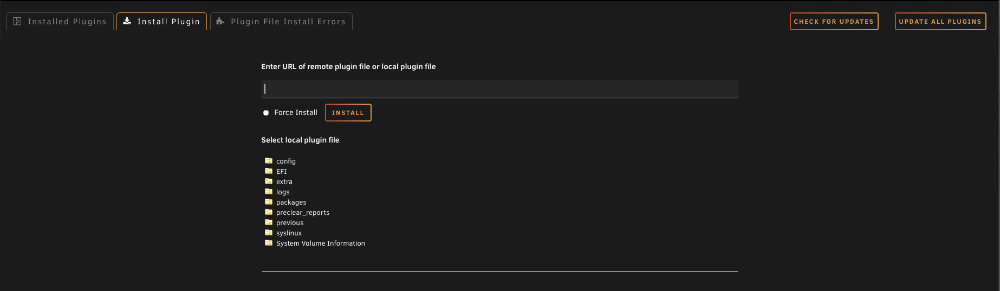
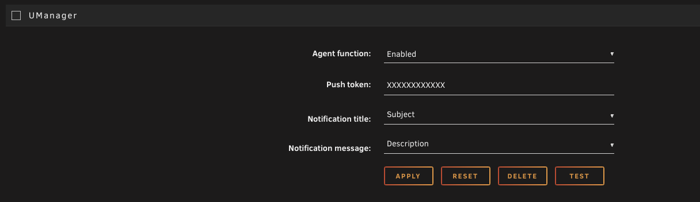

# U-Manager Unraid Plugin

Notification agent that delivers your Unraid notifications to the [U-Manager](https://github.com/jandrop/u-manager) iOS / Android app as push notifications.

This plugin registers itself as a Dynamix Notifications agent. When Unraid raises a notification (Subject + Description), the plugin forwards it to the device whose push token is configured here.

---

## Installation

### From Unraid WebGUI

1. Open your Unraid WebGUI and go to **Plugins** → **Install Plugin**.
2. In the field **"Enter URL of remote plugin file or local plugin file"**, paste:

   ```
   https://raw.githubusercontent.com/jandrop/u-manager-unraid-plugin/main/UManager.plg
   ```

3. Click **INSTALL** and wait for the installation to finish.



### From command line (advanced)

```bash
plugin install https://raw.githubusercontent.com/jandrop/u-manager-unraid-plugin/main/UManager.plg
```

---

## Configuration

### Step 1 — Get your push token in U-Manager

1. Open the **U-Manager** app on your phone.
2. Go to **Settings** → **Notifications**.
3. Enable the **Push notifications** toggle.
4. Copy the token shown below the toggle.

> **The token is regenerated each time you toggle notifications off and back on.** If you do that, you must paste the new token into the plugin again — the old token will not deliver anymore.

### Step 2 — Configure the plugin in Unraid

1. In Unraid, go to **Settings** → **Notification Settings**.
2. Scroll to the bottom of the page — you will see a **UManager** section with these fields:

   | Field | Value |
   |---|---|
   | **Agent function** | `Enabled` |
   | **Push token** | the token you copied from U-Manager |
   | **Notification title** | `Subject` (default) |
   | **Notification message** | `Description` (default) |

3. Click **APPLY** to save.
4. Click **TEST** to send a test notification. It should arrive on your phone within a few seconds.



---

## Behaviour

- **One device per token.** A token only delivers to the device that generated it. If you paste the same token on a second phone in U-Manager, the first phone stops receiving notifications. To switch devices, generate a new token on the new phone and update the plugin.
- **Token rotates on toggle.** Disabling and re-enabling push notifications in U-Manager regenerates the token. Always re-paste the new value here.
- **Forwards every Dynamix notification.** Any notification raised through Unraid's notification system (UPS events, parity check results, Docker container alerts, plugin errors, etc.) is forwarded.

---

## Troubleshooting

- **Test notification doesn't arrive**: confirm the device is online, the token matches what U-Manager currently shows, and the **Agent function** is set to `Enabled`.
- **Notifications stopped after toggling**: re-paste the new token from U-Manager — toggling regenerates it.
- **Wrong phone receives them**: a token is bound to one device. Generate a new token on the desired phone and update the plugin.

---

## Project layout

```
UManager.plg                      # Plugin manifest installed by Unraid
plugins/dynamix/
  agents/UManager.xml             # Dynamix notifications agent definition
  icons/umanager.png              # Plugin icon shown in the UI
```

---

## Credits

This plugin follows the standard **Dynamix Notifications agent** pattern provided by [Unraid](https://unraid.net) — the same format used by all the stock agents (Pushbullet, Telegram, Discord, Pushover, Slack, ntfy.sh, etc.) shipped with Unraid in [`emhttp/plugins/dynamix/agents/`](https://github.com/unraid/webgui/tree/master/emhttp/plugins/dynamix/agents).

The Dynamix system, the agent XML format, the `$SUBJECT` / `$DESCRIPTION` / `$IMPORTANCE` variables, and the `.plg` plugin manifest are all the work of Lime Technology / Unraid. This plugin is just a thin shim that takes the notification Unraid raises and forwards it via Cloudflare Workers to the U-Manager mobile app.

---

## License

See [LICENSE](LICENSE).
